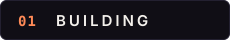
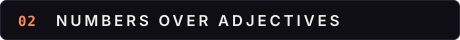
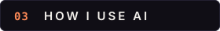
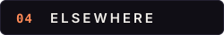

  <picture>
    <source media="(max-width: 600px)" srcset="assets/banner-mobile.svg">
    
  </picture>

  
  
  
  

Digital Craftsman. I build systems that remove friction, then teach people to do the same.

**KineticOS** is the operating system I built to run my own life (money, work, content,
family) with engineering discipline instead of willpower, built in public. Under the hood:
a Claude-native engine of skills, rules, and deterministic scripts over a private data
vault, context loaded in layers, memory retrieval isolated to its own agent. The code that
touches my life stays private; the patterns don't. I document them as I go.

**Praxis** is the canonical operating standard that turns any idea into a documented,
AI-buildable, scalable project from line zero.

**Kinetic Matrix** is the umbrella. Engineers train at
[the dojo](https://dojo.kineticmatrix.io): reps, mastery, apps shipped from line zero.

- KineticOS reconciled a CPA-filed tax return line by line, surfaced **$16,399 of
  understated income**, and refused to emit a number when 16 spend categories had no
  mapping. A tool that stops is worth more than a tool that guesses.
- The same operating principles held at organizational scale: an AI-governance rollout at
  a major media company baselined **7,835 commits**, caught **3 real credential classes**
  (all rotated inside 48 hours), and tuned false positives **67 → 8** by fixing config,
  never by ignoring the gate.
- Bootstrap to productization in four weeks: nightly maintenance, encrypted offsite
  backup, a monthly restore probe that has to pass, and **146 self-test assertions**
  guarding the ingest pipeline.

Not as a chat window. As an execution layer: defined pipelines, definitions of done,
deterministic scripts for deterministic work, model output only where judgment lives. The
tradeoff is that you have to write the checklist. Most people skip that part and then call
the output generic.

[itsmarcosjreyes.com](https://itsmarcosjreyes.com) ·
[X](https://x.com/itsmarcosjreyes) ·
[the dojo](https://dojo.kineticmatrix.io)

 

  

  <samp>good energy your way</samp>

